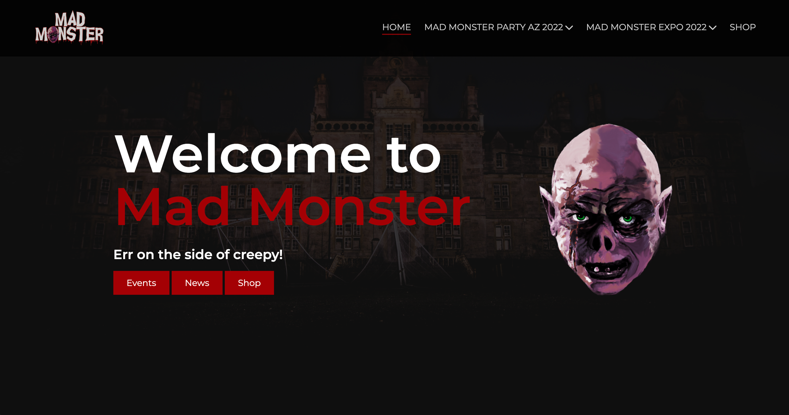

# Mad Monster - Clone

This project was inspired by [The Mad Monster Event](https://madmonster.com/). Being that this is an event that my wife and I go to, I decided to design a few areas of the site myself and create a clone.

## Overview

Create my own version of the Mad Monster website

### Screenshot

### Links

- Solution URL: [View Github Code](https://github.com/jchapar/madMonsterClone)
- Live Site URL: [Visit Site](https://jchapar.github.io/madMonsterClone/)

### Built with

- Semantic HTML5 markup
- TailwindCSS
- Flexbox
- CSS Grid
- Mobile-first workflow
